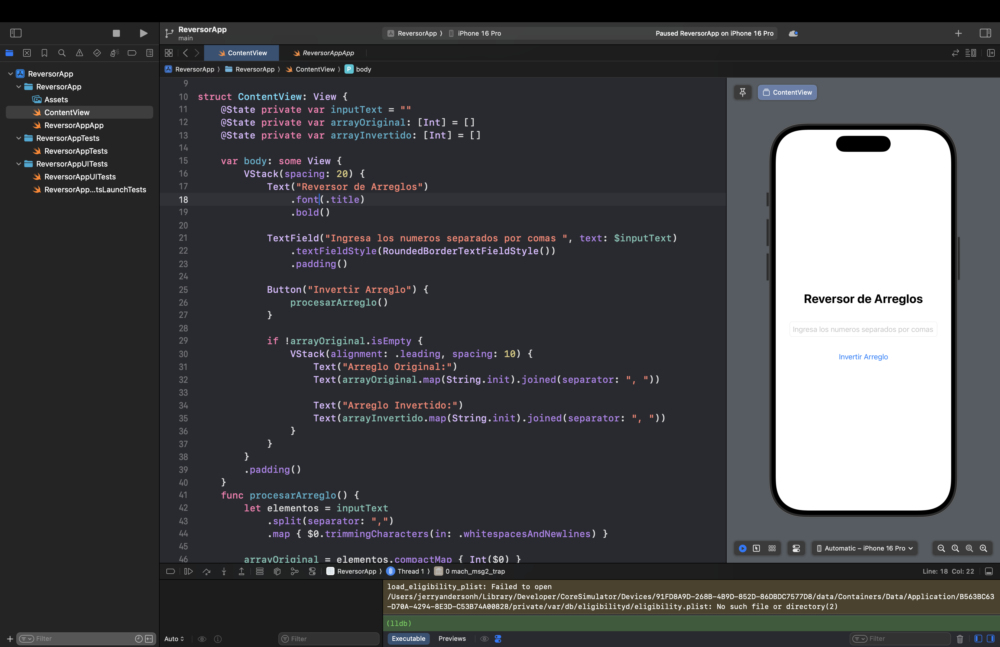

# ReversorApp

Una aplicación iOS escrita en SwiftUI para invertir los elementos de un arreglo ingresado por el usuario.

## Funcionalidades

- Ingreso de números por el usuario
- Visualización del arreglo original
- Visualización del arreglo invertido

## Tecnologías

- Swift 5
- SwiftUI
- Xcode

## Cómo ejecutar

1. Clona este repositorio
2. Abre el archivo `.xcodeproj` con Xcode
3. Ejecuta en el simulador o en un dispositivo

## Vista principal de la app:

